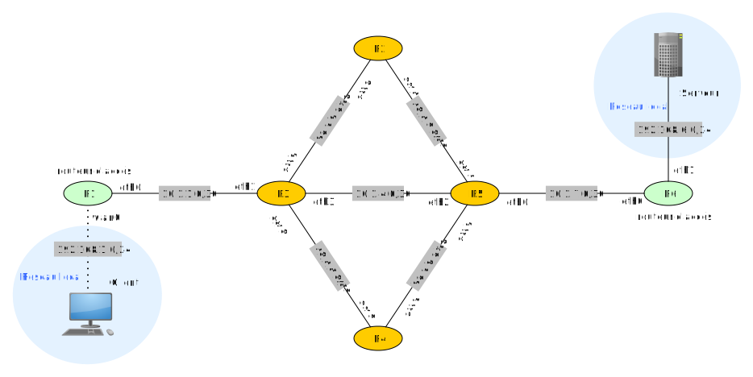
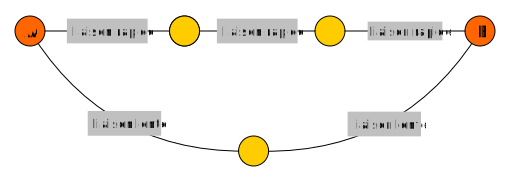
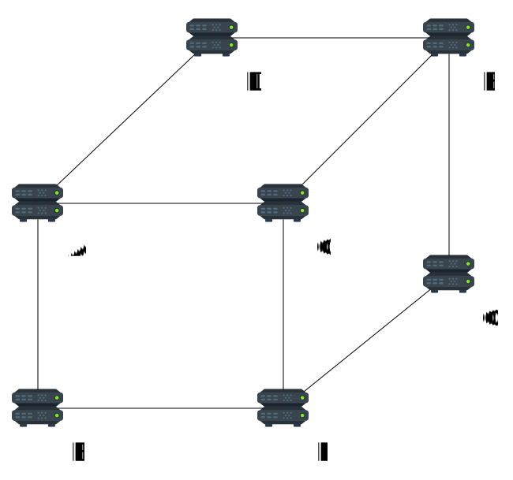
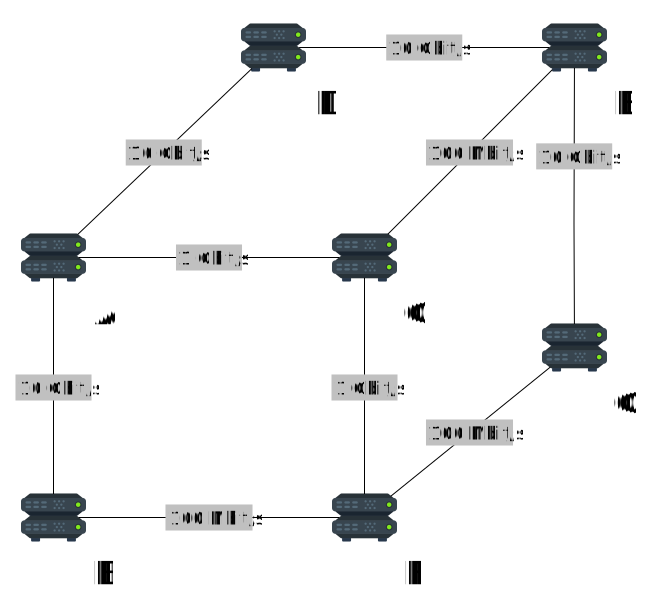
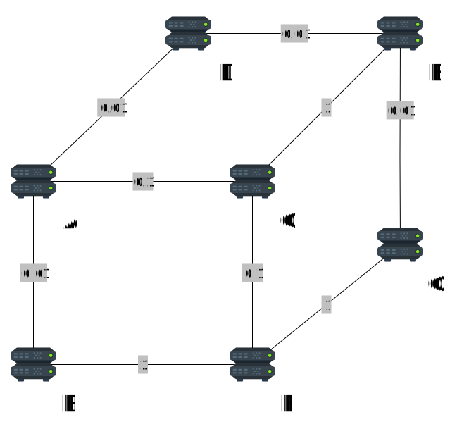
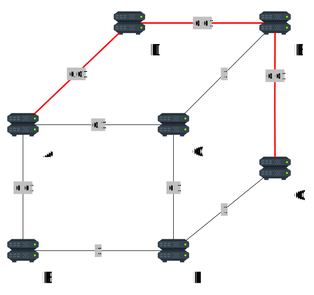

Lors d'une communication *via* un réseau, nous allons distinguer 3 éléments :

- une machine appelée *client* doit envoyer une information à une autre machine ;
- cette deuxième machine s'appelle un *serveur*.

---

Les termes *client* et *serveur* sont très larges et peuvent en fait

- désigner une *machine* aussi bien qu'une *application* s'exécutant sur cette machine ;
- alterner au cours du temps (le client devient serveur et vice-versa).

--- 

On a vu en classe de première que lors de la communication l'information est découpée en de multiples paquets de petite
taille.

Ces paquets doivent arriver à destination.

---

Le troisième élément de la communication sont les *routeurs*.

Ce sont eux qui acheminent les paquets au sein du réseau.

---

# Les routeurs

---

Ils peuvent être de deux types :

- *routeurs d'accès* lorsqu'ils sont en *bordure de réseau*, c'est-à-dire qu'ils sont directement interfacés avec un
  réseau
  *local* ;

- *internes* sinon.

---

Voici un schéma qui montre la *topologie* d'un réseau, c'est-à-dire son architecture.

{width=100%}

---

## Un réseau en détail

---

Le réseau comprenant R1 et R3 a pour adresse 10.0.1.0/30 : il ne reste donc que 2 bits libres pour adresser les
machines, soit 4 possibilités.

---

Si on enlève l'adresse réseau 10.0.1.0 et l'adresse *broadcast* 10.0.1.3 il reste 2 IP, une pour chaque routeur.

---

Ainsi par exemple

- R1 peut avoir l'IP 10.0.1.1 ;
- R3 aura dans ce cas l'IP 10.0.1.2 ;
- ou l'inverse.

---

R1 est un routeur *externe* :

- il a aussi une IP dans le réseau local du client et réalise ainsi une *passerelle* ;
- c'est cette IP que le client utilise pour envoyer des informations à l'extérieur de son réseau local.

---

R3 est un routeur *interne* :

- il a 3 IP différentes sur les 3 réseaux auxquels il est connecté.

---

# Routage des paquets

---

Lorsqu'un paquet doit transiter du client au serveur

- il doit obligatoirement passer la passerelle R1 ;
- là encore il n'y a pas le choix, il passera par R3.

---

Mais ensuite ?

Comment la route à emprunter est-elle déterminée ?

Est-ce la même tout le temps ?

---

En fait, chaque routeur possède une *table de routage* qui associe les IP de destination à des routeurs particuliers.

---

Ces tables ne sont pas fixes.

*A priori* tous les routeurs ont le même statut (il n'y a pas de routeur privilégié).

---

Les méthodes qui permettent de gérer ces tables de routage sont appelés des *protocoles de routage*.

---

# Le protocole RIP

*(Routing Information Protocol)*

---

## Principe

À intervalles de temps réguliers, chaque routeur envoie à ses voisins

- les adresses réseau de ses propres routeurs voisins ;
- les adresses qu'il a reçues par d'autres routeurs.

---

Pour chaque adresse, il indique également combien de sauts sont nécessaires pour l'atteindre, c'est-à-dire par combien
de routeurs (y compris lui-même) il faut passer.

---

Lorsqu'un routeur reçoit les informations d'un routeur voisin, 4 cas peuvent survenir :

---

1. Une route vers un nouveau sous-réseau lui est présentée : il l'ajoute à sa table de routage.

---

2. Une route vers un sous-réseau déjà connu lui est présentée, mais plus courte que la précédente. Dans ce cas
   l'ancienne est remplacée par celle-ci.

---

3. Une nouvelle route vers un sous-réseau plus longue lui est transmise par un autre voisin que celui de l'ancienne route : il l'ignore.

---

4. Une route existante, passant par le même voisin, mais plus longue que celle de la table de routage lui est présentée.
   Cela veut dire qu'un problème est survenu sur l'ancienne route. Celle-ci est donc effacée et remplacée par la plus
   longue.

---

Pour éviter les boucles, les distances doivent être au maximum de 15 (sinon elles sont ignorées).

RIP fonctionne donc sur des réseaux de taille modeste.

---

## Exemple

---

Reprenons le réseau précédent et intéressons-nous uniquement aux routeurs R1 et R3.

### Étape 1 : initialisation

---

Au début de la mise en service du réseau voici la table de routage de R1 :

|   destination    |  passerelle  |  interface  |  distance   |
|:----------------:|:------------:|:-----------:|:-----------:|
|   10.0.1.0/30    |      	       |    eth0     |      1      |
|  192.168.1.0/24  |      	       |    wlan0    |      1      |

---

Elle indique que le sous-réseau local 192.168.1.0/24 est immédiatement accessible *via* l'interface *WiFi* wlan0 depuis
ce propre routeur R1. Elle est donc à distance 1 de R1.

De même l'autre sous-réseau est accessible *via* un port *Ethernet*
du routeur nommé eth0 et est également à distance 1 de R1.

---

Voici celle de R3 :

| destination | passerelle | interface | distance |
|:-----------:|:----------:|:---------:|:--------:|
| 10.1.1.0/30 |            |   eth1    |    1     |
| 10.1.2.0/30 |            |   eth2    |    1     |
| 10.1.3.0/30 |            |   eth0    |    1     |
| 10.1.4.0/30 |            |   eth4    |    1     |

---

C'est la même chose : R3 est initialisé avec ses voisins directs.

Les noms des interfaces sont relatifs à R3.

R1 et R3 sont reliés par *Ethernet* sur le port eth0 de R1 et eth1 de R3. Ces ports peuvent avoir le même nom ou pas,
peu importe, car ces noms n'existent que relativement au routeur concerné.

---

### Étape 2 : première itération de RIP

Chaque routeur envoie ses informations à ses voisins. La table de R1 change :

---

|  destination   | passerelle | interface | distance |
|:--------------:|:----------:|:---------:|:--------:|
|  10.0.1.0/30   |            |   eth0    |    1     |
| 192.168.1.0/24 |            |   wlan0   |    1     |
|  10.0.2.0/30   |  10.1.1.2  |   eth0    |    2     |
|  10.0.3.0/30   |  10.1.1.2  |   eth0    |    2     |
|  10.0.4.0/30   |  10.1.1.2  |   eth0    |    2     |

---

R1 sait maintenant qu'il peut atteindre les machines du sous-réseau 10.1.2.0/30 *via* la passerelle 10.1.1.2 (IP de R2)
sur le sous-réseau 10.1.1.0/30.

L'interface est eth0 et la distance est 2.

---

La table de R3 change aussi :

---

|  destination   | passerelle | interface | distance |
|:--------------:|:----------:|:---------:|:--------:|
|  10.1.1.0/30   |            |   eth1    |    1     |
| 192.168.1.0/24 |  10.1.1.1  |   eth1    |    2     |
|  10.1.2.0/30   |            |   eth2    |    1     |
|  10.1.3.0/30   |            |   eth0    |    1     |
|  10.1.4.0/30   |            |   eth3    |    1     |
|  10.1.7.0/30   |  10.1.4.2  |   eth3    |    2     |

---

### Étape 3 : convergence après quelques itérations

Dans notre cas, après 2 autres itérations, les informations se stabilisent.

On dit qu'il y a *convergence*.

Chaque routeur connaît le chemin à emprunter pour accéder à n'importe quel sous-réseau.

---

Table de R1 « stabilisée »

---

|  destination   | passerelle | interface | distance |
|:--------------:|:----------:|:---------:|:--------:|
|  10.0.1.0/30   |    	       |   eth0    |    1     |
| 192.168.1.0/24 |            |   wlan0   |    1     |
|  10.0.2.0/30   |  10.1.1.2  |   eth0    |    2     |
|  10.0.3.0/30   |  10.1.1.2  |   eth0    |    2     |
|  10.0.4.0/30   |  10.1.1.2  |   eth0    |    2     |
|  10.0.5.0/30   |  10.1.1.2  |   eth0    |    3     |
|  10.0.6.0/30   |  10.1.1.2  |   eth0    |    3     |
|  10.0.7.0/30   |  10.1.1.2  |   eth0    |    3     |
| 192.162.6.0/24 |  10.1.1.2  |   eth0    |    4     |

---

Le protocole RIP fait suivre des routes minimisant le nombre de sauts.

Cela peut être une très mauvaise idée !

---

{width=100%}

---

Il faut prendre en compte le débit des interconnexions.

C'est ce que fait le protocole OSPF.

---

# Protocole OSPF

*Open Shortest Path First*

---

Le principe est simple : choisir la route la plus « rapide ».

---

- Selon ce protocole, les routeurs ont une vision globale d'une *aire* (réseau entier s'il est de taille modeste, portion de ce réseau sinon).
- Chaque routeur connaît donc le *topologie du réseau* et les bandes passantes des connexions entre routeur.

---

---

Les *bandes passantes* sont également connues

---

---

À chaque liaison on associe un *coût* :

- le coût d'une liaison est inversement proportionnel à la bande passante ;

- en général il est de $\dfrac{10^8}{d}$, où $d$ est la bande passante de la liaison en bits/s.

---

---

Chaque routeur applique l'algorithme de Dijkstra pour déterminer les chemins de coûts minimaux.

On verra cet algorithme plus tard, pour l'instant on le détermine à la main.

---

